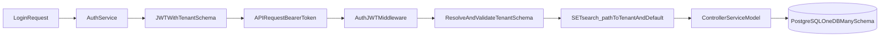

# Implementasi Migrasi MySQL ke PostgreSQL (Multi-Schema)

Dokumen ini menjelaskan **apa saja yang sudah diimplementasikan** pada project `backend_presensi` untuk migrasi ke PostgreSQL, **flow runtime** schema tenant, dan status apakah project sudah bisa langsung dipakai.

---

## 1. Ringkasan Implementasi yang Sudah Dilakukan

Berikut perubahan utama yang sudah diterapkan:

1. **Konfigurasi database dipindah ke env**
   - File: `config/database.php`
   - Default koneksi diarahkan ke `pgsql`
   - Hardcoded credential dihapus
   - `search_path` memakai `DB_SCHEMA`

2. **Konfigurasi tenancy ditambahkan**
   - File: `config/tenancy.php`
   - Menyediakan:
     - `default_schema`
     - `fallback_to_default_schema`
     - `allowed_schemas` (whitelist dari env)

3. **Resolver tenant schema dari JWT + set search_path**
   - File: `app/Http/Middleware/AuthJWT.php`
   - Middleware membaca `tenant_schema` dari payload JWT
   - Validasi format schema (`^[a-z_][a-z0-9_]*$`)
   - Validasi opsional terhadap whitelist schema
   - Menjalankan `SET search_path TO "<tenant>", "<default>"`

4. **Payload JWT menyertakan tenant_schema saat login**
   - File:
     - `app/Services/AuthAdminService.php`
     - `app/Services/AuthPegawaiService.php`
   - Validasi input `tenant_schema` ditambahkan pada controller login:
     - `app/Http/Controllers/AuthAdminController.php`
     - `app/Http/Controllers/AuthPegawaiController.php`

5. **Penyesuaian query MySQL-specific ke PostgreSQL**
   - `JSON_CONTAINS` -> `jsonb @>` pada:
     - `app/Models/PresensiJadwalDinas.php`
   - `LIKE` -> `ILIKE` dan `DATE(...)` -> `::date` pada:
     - `app/Services/EventService.php`

6. **Pembersihan validasi yang hardcoded koneksi MySQL**
   - `exists:mysql.xxx,id` diubah menjadi `exists:xxx,id` pada:
     - `app/Http/Controllers/PengajuanCutiController.php`
     - `app/Http/Controllers/PengajuanIzinController.php`
     - `app/Http/Controllers/PengajuanSakitController.php`

7. **Penyesuaian migration**
   - File: `database/migrations/2026_05_25_153713_create_full_database_schema.php`
   - Kolom `pegawai_ids` diubah ke tipe `jsonb`

8. **Script provisioning tenant schema**
   - File: `scripts/provision-tenant-schema.php`
   - Fungsi:
     - Membuat schema tenant jika belum ada
     - Mengatur koneksi untuk migrate/seed ke schema tenant
     - Menjalankan migration + optional seed

9. **Test dasar tenancy**
   - File: `tests/Feature/AuthJWTTenantSchemaTest.php`
   - Menguji resolve schema valid/invalid dari payload.

---

## 2. Flow Runtime Multi-Schema



### Penjelasan flow:

1. User login sambil membawa `tenant_schema` (opsional, sesuai konfigurasi fallback).
2. Service auth membuat JWT dengan claim `tenant_schema`.
3. Saat request API berikutnya, middleware `AuthJWT` decode token.
4. Middleware validasi `tenant_schema` lalu set `search_path`.
5. Semua query Eloquent/Query Builder setelah itu berjalan pada schema tenant aktif.

---

## 3. Cara Provisioning Client Baru

Contoh untuk tenant `client_a`:

```bash
php scripts/provision-tenant-schema.php client_a --seed
```

Yang terjadi:
- `CREATE SCHEMA IF NOT EXISTS client_a`
- Koneksi diarahkan ke `search_path=client_a,public`
- `php artisan migrate`
- `php artisan db:seed` (jika pakai `--seed`)

---

## 4. Konfigurasi Env yang Direkomendasikan

```env
DB_CONNECTION=pgsql
DB_HOST=127.0.0.1
DB_PORT=5432
DB_DATABASE=backend_presensi
DB_USERNAME=postgres
DB_PASSWORD=your_password

DB_SCHEMA=public
TENANT_SCHEMA_WHITELIST=client_a,client_b
TENANCY_FALLBACK_TO_DEFAULT=true
```

---

## 5. Apakah Project Ini Tinggal Pakai?

**Jawaban singkat: hampir tinggal pakai, dengan prasyarat deployment berikut dipenuhi.**

### Sudah siap:
- Arsitektur multi-schema runtime via `search_path` sudah ada.
- JWT tenant claim sudah terpasang.
- Query kritikal MySQL-specific yang terdeteksi sudah dimigrasi.
- Provisioning tenant schema sudah ada script-nya.

### Yang wajib dipastikan sebelum production:
1. `.env` production sudah mengarah ke PostgreSQL.
2. Whitelist tenant schema (`TENANT_SCHEMA_WHITELIST`) sudah benar.
3. Jalankan provisioning schema untuk semua client awal.
4. Jalankan smoke test endpoint utama: auth, presensi, event, dashboard.
5. Verifikasi data isolasi antar tenant (token tenant A tidak melihat data tenant B).

Jika 5 poin di atas lolos, maka project **siap dipakai** untuk skenario 1 database multi-schema per client.

---

## 6. Catatan Operasional

- Penambahan client baru seharusnya tidak perlu ubah query aplikasi.
- Cukup buat schema baru + migrate/seed + distribusikan token dengan `tenant_schema` yang sesuai.
- Jika ada query raw SQL baru di masa depan, biasakan syntax PostgreSQL dari awal.
